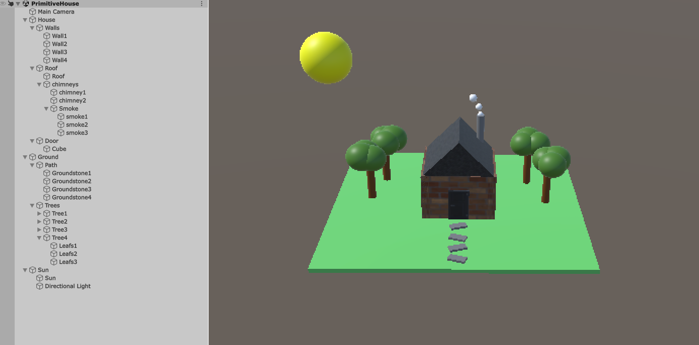

# Oefening 1.1A Primitive Building Challenge

## Beschrijving

Ik heb een eenvoudig huis gebouwd met verschillende materialen en vormen. Ik heb ook de bonus oefening gedaan.

## Wat ik geleerd heb

* Hoe ik werk met materialen en vormen werk
* hoe ik met de transform component werk
* hoe ik mijn eigen materialen kan maken

## Beeld

