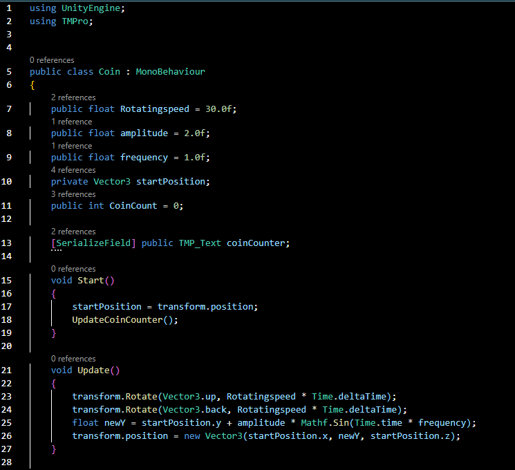
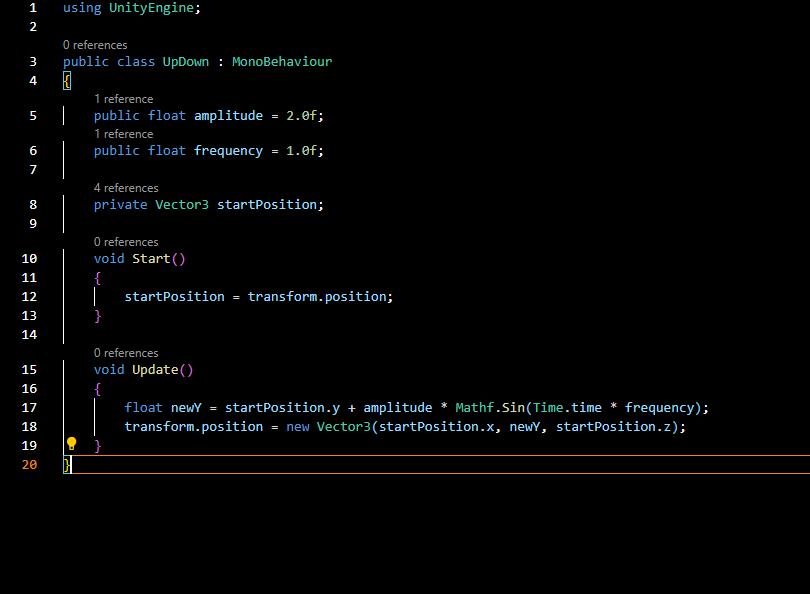

# Oefeningen 2.1ABC Scriptmatige Beweging

## Beschrijving

Ik maakte een draaiende munt die op en neer gaat, daarna maakte ik twee goomba's die lineair bewegen en daarna maakte ik nog een Boo die om zijn eigen as draait.
Ik heb alleen de bonus oefeningen in A en B gedaan

## Wat ik geleerd heb

* Hoe ik gameobjects met scripts kan bewegen
* Hoe ik gameobjects kan draaien 
* Hoe ik met de script in de inspector werk met public variablen

## GIF

## Scripts

### Script van de Munt

---

### Script van de Goomba

---

### Scripts van de Boo

