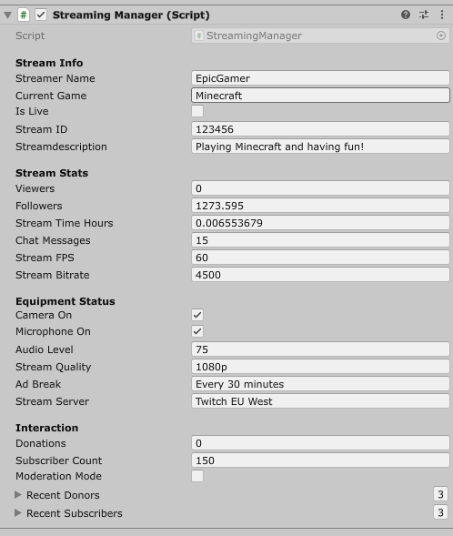
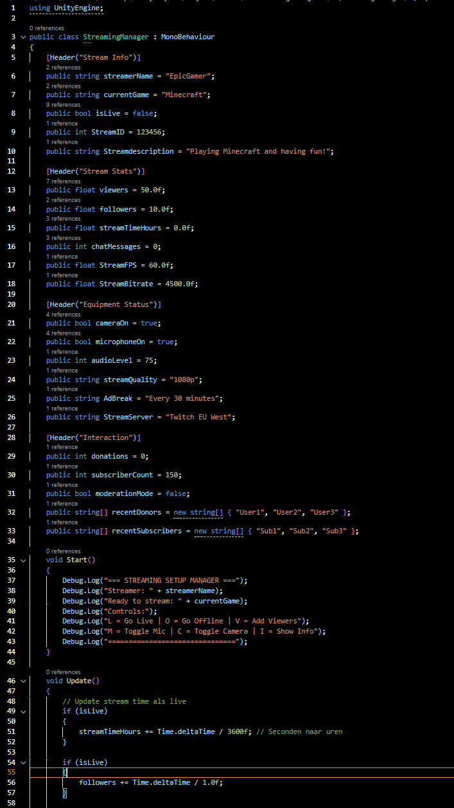
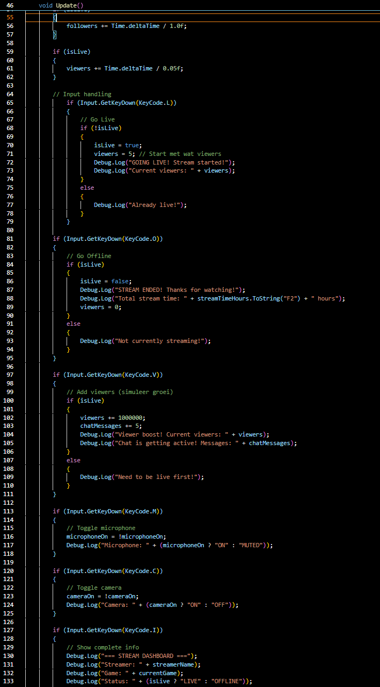
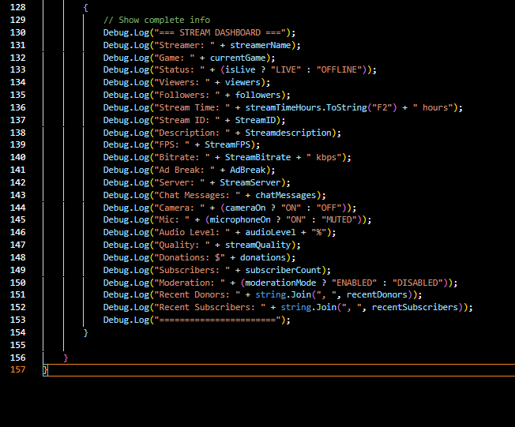

# Oefening 2.2B Streaming Setup Manager

## Beschrijving

Ik heb alleen de bonus oefeninge met de follower groei

## Wat ik geleerd heb

* Hoe ik met inputs van de speler werk
* Hoe ik met de input van de speler andere events kan starten zoals iets in het game of debug log

## GIF

## Beeld

## Scripts

